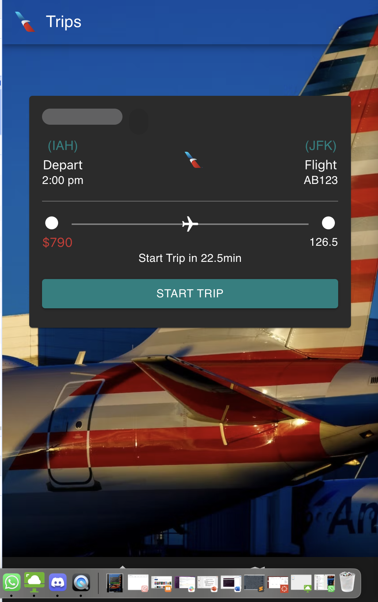
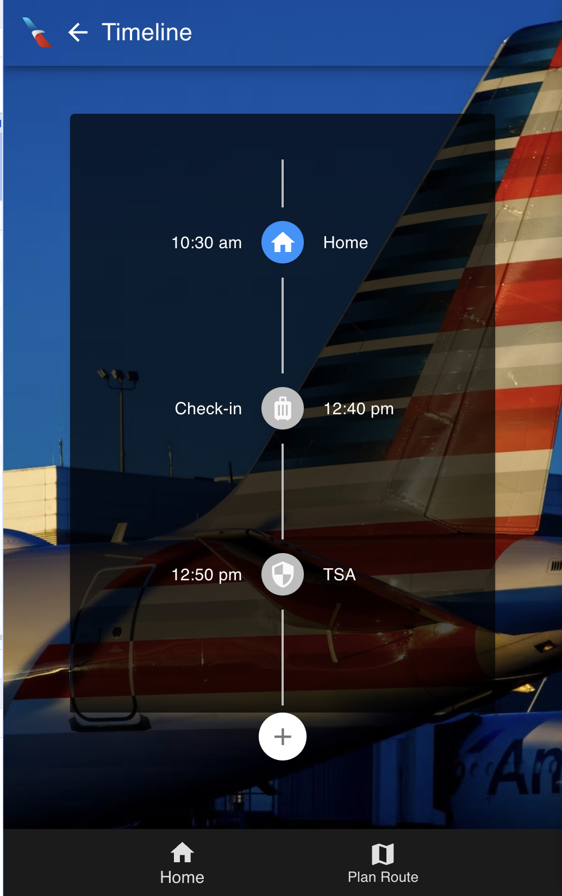
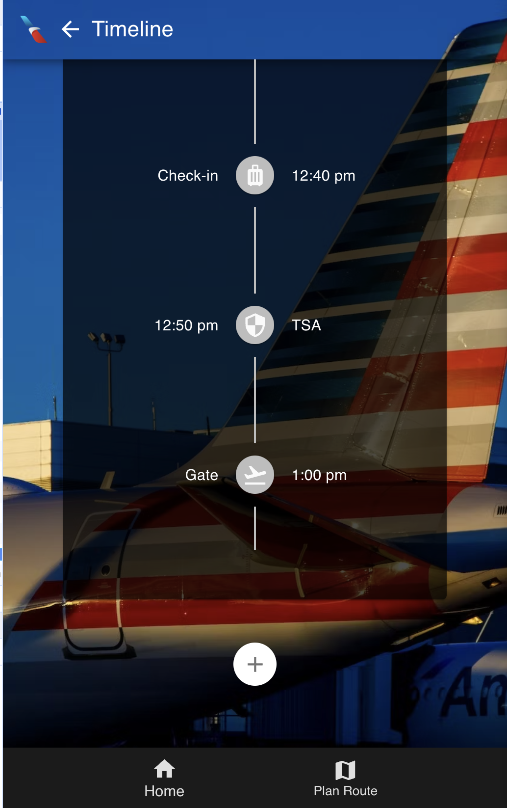
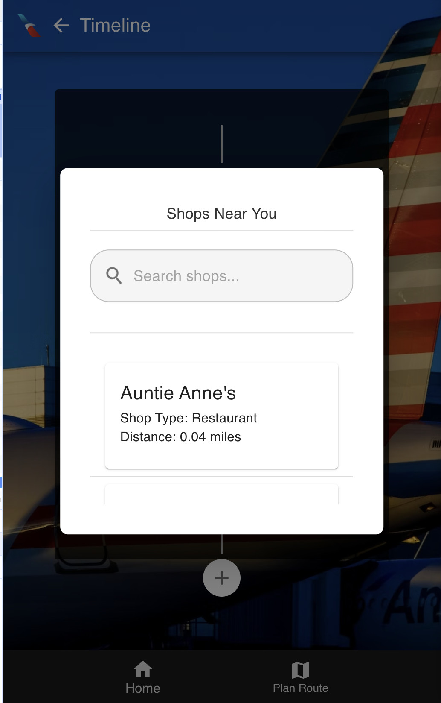

# SmartFly

SmartFly is an innovative airport time management application developed as a prototype for the American Airlines challenge at the tamuhackx hackathon hosted by Texas A&M University. Designed to optimize the travel experience, SmartFly integrates real-time updates and personalized recommendations, ensuring that travelers are efficiently guided through the airport and can enjoy their time before boarding their flights.

## Technology Stack


<!--  -->

## Key Features

- **TSA Wait Time Calculation**: Delivers real-time updates on TSA security check wait times.
- **Airport Arrival Time Calculation**: Calculates the best time to arrive at the airport based on flight schedules and current traffic conditions.
- **Side Quest Recommendations**: Provides personalized recommendations for activities and amenities post-TSA check, enhancing the travel experience.
- **Gate Time Calculator**: Offers an estimated time to reach the departure gate from TSA checkpoints.
- **User Activity History**: Keeps track of user preferences to deliver more personalized recommendations in the future.
- **Miscellaneous Time Management**: Assists with the management of various pre-flight activities, ensuring a smooth and stress-free airport experience.

## Development Environment Setup

Below are the steps and requirements for setting up the development environment for SmartFly. It includes both backend and frontend setups.

### Backend Setup

#### Dependencies

Ensure the following Python libraries are installed:

- `django`
- `django-heroku`
- `psycopg2-binary`
- `googlemaps`

#### Installation

To install these dependencies and set up the backend, follow these steps. Using a virtual environment is recommended to prevent conflicts with other projects or system-wide packages.

1. **Setting up a Virtual Environment (Optional but Recommended)**
   - Install `virtualenv` if not already installed:
     ```bash
     pip install virtualenv
     ```
   - Create and activate a virtual environment:
     ```bash
     virtualenv venv
     source venv/bin/activate  # On Windows use `venv\Scripts\activate`
     ```

2. **Install Dependencies**
   - Install required libraries using `pip`:
     ```bash
     pip install django django-heroku googlemaps psycopg2-binary
     ```

3. **Database Migrations and Server Start**
   - Execute the following commands to make database migrations and start the development server:
     ```bash
     python manage.py makemigrations
     python manage.py migrate
     python manage.py runserver
     ```

### Frontend Setup

#### Dependencies

- Node.js (latest version recommended)
- React
- Material UI
- CSS

#### Installation Steps

1. Navigate to the backend directory and install Node.js dependencies:
   ```bash
   cd backend/
   npm install
   npm start

# SmartFly Backend API Endpoints

SmartFly's backend API provides various endpoints to access real-time data and functionalities essential for optimizing the airport experience. Below is a list of available endpoints with their expected request methods and, where applicable, the structure for the request body.

## Gates

### GET /gates/get-gate/
- **Description:** Retrieves details of all gates.
- **Request body:** Not required.

### POST /gates/get-walk-time/
- **Description:** Calculates walking time to a specific gate.
- **Request body:**
  ```json
  {
    "current_location": "Location identifier or coordinates",
    "gate_id": "Gate identifier"
  }
  ```

### POST /arrival-time/calculate-arrival/
- **Description:** Estimates time from the current location to the airport.
- **Request body:**
  ```json
  {
  "current_location": "Location identifier or coordinates",
  "airport_id": "Airport identifier"
  }
  ```

## TSA Wait Time

### GET /tsa-wait-time/get-wait-time/
- **Description:** Provides current TSA wait time
- **Request body:** Not required.

## Departure Time

### POST /departure-time/get-dt/
- **Description:** Gives the boarding stop time for a selected flight.
- **Request body:** 
  ```json
  {
  "flight_number": "Flight number"
  }
  ```

## Miscellaneous Time

### GET /misc-time/get-shop/
- **Description:** Lists all shops within the airport
- Request body: Not required

### POST /misc-time/get-walk-time/
- **Description:** Estimates walking time to a specific shop.
- **Request body:**
  ```json
  {
  "current_location": "Location identifier or coordinates",
  "shop_id": "Shop identifier"
  }
  ```

## Recommendations
### POST /recommend/get-rec/
- **Description:** Suggests places to visit based on user preferences and location.
- **Request body:**
  ```json
  {
  "user_preferences": ["Preference1", "Preference2"],
  "current_location": "Location identifier or coordinates"
  }
  ```

## Flight Details
### POST /flight-details/get-flight-details/
- **Description:** Returns flight details for a given flight number.
- **Request body:**
  ```json
  {
  "flight_number": "Flight number"
  }
  ```
- Please replace `"Location identifier or coordinates"`, `"Gate identifier"`, `"Airport id"`, `"Shop id"`, and `"Flight number"` with the actual values as per your requirements. Adjustments to the actual endpoint paths, HTTP methods, and request body specifications should be made according to your backend implementation and business logic.

# Project Snapshots:

<p align="center">
  
  
</p>
<p align="center">
  
  
</p>

*Note:* *As SmartFly was developed as a prototype for the American Airlines challenge at the tamuhackx hackathon, the features and functionalities showcased here are subject to further development and refinement.*


